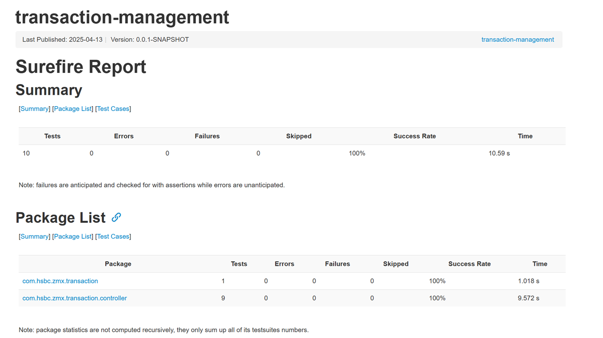
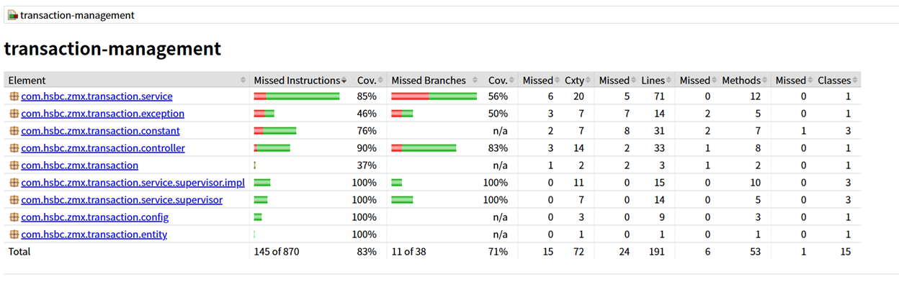
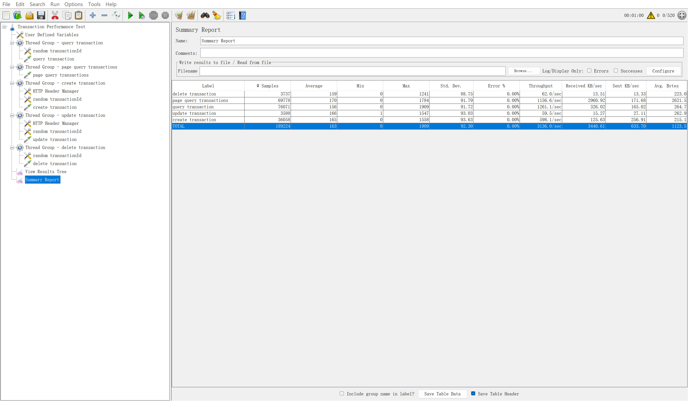

# Transaction Management System

## Project Introduction
This is a simple application related to transaction management within a banking system. It enables users to record, view, and manage financial transactions.

## Project Implementation
- Write in Java 21 and Spring Boot.
- All data are held in memory, we use H2 for this project.
- Use caffeine for caching.
- Use Spring Data JPA for data access.
- Use Spring MVC for web layer.
- Use Maven for project management.
- Containerization with Docker.
- Use Lombok for reducing boilerplate code.
- Use Swagger for API documentation.
- Use JUnit 5 for testing.
- Use JMeter for stress testing.

### 3PP Introduction
| Dependency Name                     | Purpose                                                                                           |
| ----------------------------------- | ------------------------------------------------------------------------------------------------- |
| spring-boot-starter-actuator        | Provides monitoring features like health checks and metrics collection.                           |
| spring-boot-starter-validation      | Enables data validation using Jakarta Bean Validation.                                            |
| spring-boot-starter-web             | Supports web development with Spring MVC and embedded Tomcat.                                     |
| spring-boot-starter-data-jpa        | Facilitates database operations using JPA (ORM).                                                  |
| spring-boot-starter-cache           | Offers caching abstraction for integration with various cache providers.                          |
| caffeine                            | High-performance local cache implementation.                                                      |
| h2                                  | Embedded database for runtime use, typically in development/testing.                              |
| lombok                              | Simplifies Java code by generating getters, setters, etc., via annotations.                       |
| springdoc-openapi-starter-webmvc-ui | Automatically generates REST API documentation with Swagger UI.                                   |
| spring-boot-starter-test            | Supports testing with tools like JUnit and Mockito, excluding `xmlunit-core` for security reason. |

## Project Build
To build the project, run the following command:
```bash
mvn clean package                # build the project
mvn spring-boot:build-image      # build the docker image
```

## Project Run
To run the project, run the following command:
```bash
docker run -d --name transaction-management -p 8080:8080 docker.io/library/transaction-management:0.0.1-SNAPSHOT
```

## Project Test

```bash
mvn test                            # run the test
mvn surefire-report:report          # generate the test report
mvn jacoco:report                   # generate the coverage report
```

Testcase report path: `target/reports/surefire.html`


Coverage report: `target/site/jacoco/index.html`



## Stress Test
Stress test the project with JMeter, test script: `src/test/resources/Transaction_Performance_Test.jmx`

Stress test report: `doc/performance_test_report.png`



## Project API Documentation
The API documentation can be accessed at address: http://localhost:8080/swagger-ui/index.html

API documentation: `doc/api_docs.yaml`


